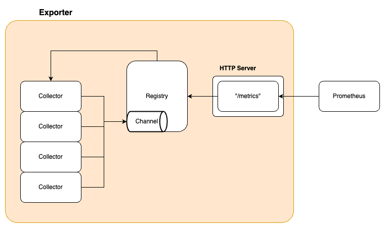
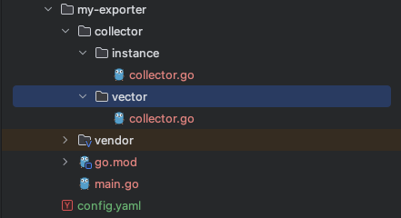

# exporter-builder
## Introduction
Prometheus는 다양한 exporter를 제공하여 서로 다른 시스템과 서비스의 메트릭을 모니터링할 수 있도록 지원합니다. 그러나 많은 개발자들이 참여하면서 exporter 각각의 구조가 달라지게 되어 기존의 exporter를 참고하여 자신만의 새로운 exporter를 개발하는데 있어 어려움을 겪을 수 있습니다.
**exporter-builder**는 이 문제를 해결하기 위해 만들어진 도구입니다. exporter-builder는 Prometheus의 exporter를 개발할 때 필요한 설정으로 쉽게 exporter의 기본 구조를 생성해주는 도구로, 사용자가 자신만의 exporter를 개발하는 과정을 간소화합니다. 이 도구를 사용하면, 복잡한 설정 없이도 효과적으로 메트릭을 수집하고 Prometheus 서버에 전달할 수 있는 exporter를 만들 수 있습니다. exporter-builder를 사용하여 어떻게 효율적으로 사용자 정의 exporter를 개발할 수 있는지 자세히 알아보겠습니다. exporter-builder를 이용하여 자신만의 exporter로 Prometheus 환경을 보다 효과적으로 활용하고, 모니터링의 범위를 확장하여 새로운 모니터링 Dashboard를 구성해볼 수 있습니다.

---

## Exporter architecture
Prometheus exporter는 여러 개의 collector로 구성되어 있으며, 이들 각각은 특정 데이터를 수집하는 역할을 수행합니다. Collector는 시스템이나 응용 프로그램으로부터 데이터를 수집하고, 이를 Prometheus 서버가 이해할 수 있는 메트릭 형태로 변환하여 전달합니다. 각 collector는 고유의 특성에 맞게 설계되어 있으며, 이에 따라 수집하는 데이터의 종류나 메트릭의 형태가 다를 수 있습니다. 따라서 collector를 정의할 때는 해당 collector의 목적과 특성을 명확히 이해하고, 이에 맞게 설정을 조정하는 것이 중요합니다. 예를 들어, 시스템의 CPU 사용률을 측정하는 collector는 시스템의 성능 관련 데이터를 수집하고 이를 메트릭으로 변환해야 하므로, 관련된 메트릭을 정확하게 정의하고 수집 주기를 적절히 설정하는 것이 필수적입니다. 이러한 과정을 통해 Prometheus는 효과적으로 데이터를 모니터링하고, 시스템이나 응용 프로그램의 상태를 정확하게 파악할 수 있습니다.



각 Collector는 고유한 특성에 맞게 설계되어야 하며, 이는 수집하는 데이터의 종류와 메트릭의 형태에 영향을 줍니다.
예를 들어 CPU 사용량을 측정하는 Collector는 성능 관련 데이터를 수집해 메트릭으로 변환하고, 정밀한 메트릭 정의와 적절한 수집 주기 설정이 필요합니다.

---

## Technology Stack
exporter-builder는 Prometheus exporter를 쉽게 구축할 수 있도록 도와주는 도구로, 특정 기술 스택을 사용하여 개발되었습니다. 이 도구의 핵심 구성 요소는 다음과 같습니다:

| 기술                     | 설명                                              |
|--------------------------|---------------------------------------------------|
| **Go**                   | exporter-builder 및 생성되는 Exporter의 구현 언어 |
| **Cobra**                | CLI 커맨드 파싱 및 플래그 관리 라이브러리         |
| **koanf**                | YAML 설정 파일 로딩 및 구조체 언마샬 라이브러리   |
| **Prometheus Go client** | 생성된 Exporter에서 메트릭 수집 및 노출에 사용    |

---

## Installation

다음 명령어로 exporter-builder를 설치합니다:

```bash
go install github.com/stdhsw/exporter-builder/cmd/builder@latest
```

정상적으로 설치되었는지 확인하려면 다음 명령어를 실행하세요:

```bash
# Check if the builder is installed
ls -al $(go env GOPATH)/bin | grep builder
```

명령어를 찾을 수 없는 경우 PATH 환경 변수를 설정합니다:

```bash
export PATH=$PATH:$(go env GOPATH)/bin
```

---

## How to use
exporter-builder를 사용하여 Prometheus exporter의 구조를 설정하고 기본적으로 Prometheus 메트릭을 생성하는 두 가지 주요 방법을 소개하겠습니다: vector 방식과 instance 방식. 이 두 방법은 Prometheus 서버로부터 요청을 받았을 때 메트릭을 어떻게 처리하고 제공하는지에 따라 구분됩니다.
- instance 방식 : 이 방식은 Prometheus 서버로부터 메트릭 요청이 들어올 때마다 새로운 메트릭을 생성하여 반환합니다. 이는 메트릭이 최신 상태로 유지되어야 하는 경우에 유용하며, 메트릭의 실시간 업데이트가 중요한 환경에서 적합합니다. 예를 들어, 매 요청마다 최신의 서버 상태나 트랜잭션 정보를 측정하고 제공해야 할 때 사용됩니다.
- vector 방식 : 이 방식에서는 메트릭을 미리 생성하고 vector에 등록합니다. Prometheus 서버로부터 메트릭 요청이 들어올 때, 사전에 vector에 등록된 메트릭들을 반환합니다. 이 접근 방식은 메트릭 수집과 처리를 미리 할 수 있기 때문에 요청 처리 시간을 단축시키는 데 유리합니다. 예를 들어, 시스템의 현재 상태를 지속적으로 모니터링하며 그 결과를 vector에 저장하고, 요청 시 즉시 이를 제공할 수 있습니다.

**1. 설정 파일 작성**
```yaml
# config.yaml
name: my-exporter
module: github.com/my-project/my-exporter
collectors:
  - vector
  - instance
```

**2. Exporter 프로젝트 생성**
```bash
# 이 명령어는 config.yaml 파일에 정의된 설정을 읽고, 해당 설정에 맞추어 새로운 exporter를 구성합니다.
builder --config-file config.yaml
```

---

## 설정 파일

설정 파일은 YAML 형식으로 작성합니다.

```yaml
name: my-exporter                          # 생성할 Exporter 디렉터리 이름
module: github.com/my-project/my-exporter  # Go 모듈 경로 (go.mod에 기록됨)
go_version: "1.26"                         # 생성될 go.mod의 Go 버전
collectors:                                # 생성할 Collector 패키지 이름 목록
  - instance
  - vector
```

| 필드         | 필수 여부 | 기본값        | 설명                                               |
|--------------|-----------|---------------|----------------------------------------------------|
| `name`       | 선택      | `DiyExporter` | 생성될 프로젝트 디렉터리 이름                      |
| `module`     | 선택      | `DiyModule`   | Go 모듈 경로 (`go.mod`의 `module` 항목)            |
| `go_version` | 선택      | `1.26`        | 생성될 `go.mod`의 Go 버전 (`go` 지시어 값)         |
| `collectors` | 선택      | `[]`          | 생성할 Collector 패키지 이름 목록 (중복 자동 제거) |

> `collectors` 목록에 동일한 이름이 중복되어도 한 번만 생성됩니다.

---

## 생성된 프로젝트 구조


| 파일                            | 설명                                                                     |
|---------------------------------|--------------------------------------------------------------------------|
| `main.go`                       | Exporter 진입점. HTTP 서버 초기화, Collector 등록, 플래그 파싱 수행      |
| `go.mod`                        | Go 모듈 정의. `go mod tidy` 및 `go mod vendor` 자동 실행으로 의존성 완성 |
| `collector/<name>/collector.go` | 각 Collector의 스캐폴딩 코드. `prometheus.Collector` 인터페이스 구현     |

### 생성된 `main.go` 기능

- Prometheus HTTP 서버 (기본 포트 `:9090`, 기본 경로 `/metrics`)
- 각 Collector의 `SetFlags()` 자동 호출
- Prometheus `Registry`에 모든 Collector 자동 등록
- 구조화 로깅 (`log/slog` + `prometheus/common/promslog`)

### 생성된 `collector.go` 인터페이스

```go
// SetFlags CLI 플래그 커스터마이징 진입점
func SetFlags()

// NewCollector Collector 인스턴스를 생성하여 반환
func NewCollector() *Collector

// Describe Prometheus가 메트릭 메타데이터를 수집할 때 호출
func (c *Collector) Describe(ch chan<- *prometheus.Desc)

// Collect Prometheus가 메트릭 값을 수집할 때 호출
func (c *Collector) Collect(ch chan<- prometheus.Metric)
```

---

## Collector 개발 가이드

exporter-builder가 생성하는 `collector.go`는 스캐폴딩 코드입니다.
아래 두 가지 패턴 중 하나를 선택하여 메트릭 수집 로직을 구현합니다.

### Instance 방식
Instance 방식은 Prometheus exporter에서 실시간으로 메트릭을 생성하고 Prometheus 서버에 전달하는 방법입니다. 이 방식은 Prometheus의 요청에 따라 메트릭을 즉시 생성하여 결과를 반환하므로, 메트릭 데이터가 최신 상태를 반영할 필요가 있는 경우에 특히 유용합니다. 이 방식은 메트릭 데이터의 실시간성이 중요한 경우, 예를 들어 서버의 현재 부하 상태나 트랜잭션 수와 같은 동적 정보를 모니터링할 때 효과적입니다. 따라서, 실시간 데이터 반영이 중요한 모니터링 시스템에서는 Instance 방식을 적극적으로 활용하는 것이 좋습니다. instance방식은 exporter-builder에서 제공하는 sample metric와 같이 metric을 생성하는 코드를 추가하여 사용합니다.

```go
package instance

import (
    "flag"
    "github.com/prometheus/client_golang/prometheus"
)

var (
    val1 = "value1"
    val2 = "value2"

    sampleDesc = prometheus.NewDesc(
        "sample_metric",
        "sample metric",
        []string{"key1", "key2"}, nil)
)

// SetFlags 커맨드라인 플래그를 등록합니다. main.go에서 자동으로 호출됩니다.
func SetFlags() {
    flag.StringVar(&val1, "val1", val1, "value1")
    flag.StringVar(&val2, "val2", val2, "value2")
}

type Collector struct{}

func NewCollector() *Collector {
    return &Collector{}
}

func (c *Collector) Describe(ch chan<- *prometheus.Desc) {
    ch <- sampleDesc
}

// Collect 스크랩 요청 시점에 메트릭을 즉시 생성하여 전달합니다.
func (c *Collector) Collect(ch chan<- prometheus.Metric) {
    ch <- prometheus.MustNewConstMetric(sampleDesc, prometheus.GaugeValue, 1, val1, val2)
}
```

**적합한 사용 사례:**
- 스크랩 시점의 실시간 시스템 상태 (CPU, 메모리 등)
- 매 요청마다 값이 달라지는 메트릭
- 외부 API를 즉시 호출하여 결과를 반환하는 경우

### Vector 방식
Vector 방식은 Prometheus exporter에서 미리 정의된 메트릭을 vector에 등록하고, Prometheus 서버의 요청이 들어올 때 등록된 메트릭을 전달하는 방법입니다. 이 방식은 주기적으로 메트릭 값을 업데이트하여 저장하고, 요청 시 즉시 이 값을 제공함으로써 처리 속도를 향상시킬 수 있습니다. Vector 방식은 시스템의 성능을 최적화하고자 할 때 유용하며, 특히 메트릭 데이터의 빠른 응답 시간이 필요한 경우에 적합합니다. 이를 통해 Prometheus 모니터링 시스템의 전반적인 효율성을 향상시킬 수 있습니다. vector 방식은 sample metric보다는 아래와 같이 코드를 수정하여 사용합니다.

```go
package vector

import (
    "github.com/prometheus/client_golang/prometheus"
)

func SetFlags() {}

type Collector struct {
    promCollectCount *prometheus.CounterVec
}

func NewCollector() *Collector {
    return &Collector{
        promCollectCount: prometheus.NewCounterVec(
            prometheus.CounterOpts{
                Name: "prometheus_collect_count",
                Help: "Number of times the Prometheus collector is called",
            },
            []string{"method"},
        ),
    }
}

func (c *Collector) Describe(ch chan<- *prometheus.Desc) {
    c.promCollectCount.With(prometheus.Labels{"method": "Describe"}).Inc()
    c.promCollectCount.Describe(ch)
}

// Collect 미리 저장된 벡터 메트릭을 반환합니다.
func (c *Collector) Collect(ch chan<- prometheus.Metric) {
    c.promCollectCount.With(prometheus.Labels{"method": "Collect"}).Inc()
    c.promCollectCount.Collect(ch)
}
```

**적합한 사용 사례:**
- 수집 비용이 높아 주기적으로만 업데이트가 필요한 메트릭
- 카운터처럼 누적되는 메트릭
- 스크랩 응답 시간을 최소화해야 하는 경우

### 두 방식 비교

| 항목             | Instance 방식                               | Vector 방식                             |
|------------------|---------------------------------------------|-----------------------------------------|
| 메트릭 생성 시점 | 스크랩 요청 시 즉시 생성                    | 미리 생성 후 저장                       |
| 데이터 최신성    | 항상 최신                                   | 마지막 업데이트 시점 기준               |
| 스크랩 응답 속도 | 수집 비용에 따라 가변                       | 빠름 (캐시에서 반환)                    |
| 주요 API         | `prometheus.NewDesc` + `MustNewConstMetric` | `CounterVec`, `GaugeVec` 등 `*Vec` 타입 |
| 적합한 메트릭    | 실시간 게이지, 순간 상태                    | 카운터, 히스토그램, 누적 값             |


## 동작 흐름

```
config.yaml
    │
    ▼
builder --config-file config.yaml
    │
    ▼
initConfig(path) → YAML 파싱 → Config{}
    │
    ▼
GenerateExporter(cfg)
    ├── 중복 Collector 이름 제거
    ├── 프로젝트 디렉토리 생성
    │     ├── <name>/
    │     └── <name>/collector/<collector>/  × N
    ├── main.go 생성       (main.go.tmpl 렌더링)
    ├── collector.go 생성  (collector.go.tmpl 렌더링 × N)
    └── go.mod 생성        (go.mod.tmpl 렌더링)
            ├── go mod tidy    (의존성 자동 해결)
            └── go mod vendor  (vendor 디렉토리 생성)
    │
    ▼
<name>/  ← 즉시 실행 가능한 완성된 Exporter 프로젝트
```

---

## 의존성

### exporter-builder (빌드 도구)

| 라이브러리               | 버전   | 용도                  |
|--------------------------|--------|-----------------------|
| `github.com/spf13/cobra` | v1.7.0 | CLI 커맨드 프레임워크 |
| `github.com/knadh/koanf` | v1.5.0 | YAML 설정 파일 파싱   |

### 생성된 Exporter

생성된 Exporter의 의존성은 `go mod tidy` 실행 시 자동으로 해결됩니다.
`go.mod.tmpl` 기반으로 최소 모듈 선언만 생성한 뒤, `go mod tidy`가 필요한 패키지를 자동으로 추가합니다.

---

## exporter-builder를 사용한 Exporter 실행 시 설정 가능한 플래그
exporter-builder로 생성된 exporter를 실행할 때, 다양한 플래그를 설정하여 exporter의 동작을 조정할 수 있습니다. 이러한 플래그를 통해 메트릭 수집의 엔드포인트, 네트워크 주소, 프로파일링 및 로그 레벨을 사용자의 요구에 맞게 구성할 수 있습니다. 아래는 각 플래그의 기능과 기본값을 설명합니다.

### web.telemetry-path
- 기능: Exporter가 메트릭을 수집할 수 있는 HTTP 엔드포인트를 설정합니다.
- 기본값: /metrics
- 사용 예: 이 플래그를 사용하여 Prometheus 서버가 메트릭을 수집할 URL 경로를 지정할 수 있습니다.

### web.listen-address
- 기능: Exporter가 메트릭을 제공할 때 사용할 네트워크 주소와 포트를 설정합니다.
- 기본값: :9090
- 사용 예: 네트워크 주소와 포트를 변경하여 다른 서비스와의 포트 충돌을 방지하거나 보안 정책에 맞게 조정할 수 있습니다.

### profiling
- 기능: Exporter 실행 중 프로파일링 기능을 활성화할지 여부를 설정합니다.
- 기본값: false
- 사용 예: 성능 분석이 필요한 경우, 이 플래그를 true로 설정하여 프로파일링 데이터를 수집할 수 있습니다.

### log.level
- 기능: 로그의 상세 수준을 설정합니다. 이 플래그를 통해 디버그, 정보, 경고 등의 로그 레벨을 조정할 수 있습니다.
- 기본값: info
- 사용 예: 로그의 상세 수준을 높이거나 낮춰서 문제 해결을 돕거나 로그의 양을 조절할 수 있습니다.

exporter-builder가 생성한 Exporter를 실행할 때 다음 플래그를 사용할 수 있습니다.

| 플래그                 | 기본값     | 설명                                                           |
|------------------------|------------|----------------------------------------------------------------|
| `--web.telemetry-path` | `/metrics` | 메트릭을 노출할 HTTP 엔드포인트 경로                           |
| `--web.listen-address` | `:9090`    | 메트릭 서버가 수신 대기할 네트워크 주소와 포트                 |
| `--profiling`          | `false`    | `true` 설정 시 `host:port/debug/pprof/` 에서 프로파일링 활성화 |
| `--log.level`          | `info`     | 로그 레벨 (`debug`, `info`, `warn`, `error`)                   |


**사용 예시:**
```bash
# 포트 변경 및 로그 레벨 조정
./my-exporter --web.listen-address=:8080 --log.level=debug

# 메트릭 경로 변경
./my-exporter --web.telemetry-path=/custom-metrics

# 프로파일링 활성화
./my-exporter --profiling=true
```


